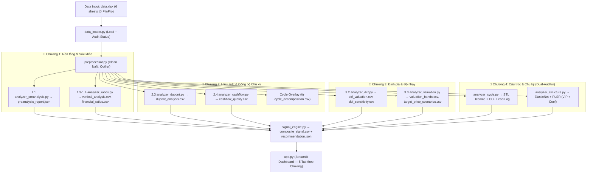

# Fiinpro Analysis — Khung Phân Tích Cơ Cấu & Chu Kỳ Tài Chính (v2.0)

Hệ thống tự động hóa phân tích BCTC định lượng chuyên sâu. Triết lý cốt lõi: **Hệ thống không dự báo — Hệ thống chẩn đoán.** Thay vì đưa ra con số dự báo điểm, hệ thống trả lời 3 câu hỏi:

1. 🏛️ **Hình thái tài chính** của doanh nghiệp trông như thế nào?
2. 🔄 **Doanh nghiệp đang ở đâu** trong chu kỳ tài chính của nó?
3. 💰 **Thị trường đang định giá** điều này đúng hay sai?

> 🌐 **GitHub Pages:** [https://wane-bs.github.io/fiinpro_tt/](https://wane-bs.github.io/fiinpro_tt/)

---

## 1. Pipeline Vận Hành (Data Flow)



---

## 2. Cấu trúc Thư mục

```text
fiinpro_analysis/
├── README.md              ← Tài liệu này
├── techspec.md            ← Đặc tả kỹ thuật chi tiết
├── requirements.txt
├── ban_ghi_md/            ← Lưu trữ bản sao tài liệu phân tích
├── src/
│   ├── main.py                    ← Entry point (chạy toàn bộ pipeline)
│   ├── data_loader.py             ← Đọc data.xlsx, tách Audit Status
│   ├── preprocessor.py            ← Làm sạch dữ liệu
│   ├── analyzer_preanalysis.py    ← Chương 1.1: Chất lượng dữ liệu
│   ├── analyzer_ratios.py         ← Chương 1.3-1.4 + 2.2: Vertical + Solvency + ROE
│   ├── analyzer_dupont.py         ← Chương 2.3: DuPont 3 nhân tố
│   ├── analyzer_cashflow.py       ← Chương 2.4: CFO/NI, Accrual Ratio
│   ├── analyzer_dcf.py            ← Chương 3.2: DCF + Sensitivity
│   ├── analyzer_valuation.py      ← Chương 3.3: Valuation Bands + Multiples
│   ├── analyzer_cycle.py          ← Chương 4a: STL Decomposition + CCF
│   ├── analyzer_structure.py      ← Chương 4b: Dual-Auditor (ElasticNet + PLSR)
│   ├── signal_engine.py           ← Composite Score + Khuyến nghị
│   ├── backtest_*.py              ← Kiểm định bổ sung (giữ nguyên)
│   └── app.py                     ← Streamlit Dashboard (5 tab theo Chương)
└── output/                ← >30 files CSV/JSON/MD tự động sinh ra
```

> ⚠️ `data.xlsx` không được commit lên GitHub. Tải từ FiinPro và đặt tại `c:\fiinpro\data.xlsx`.

---

## 3. Hướng dẫn Chạy

**Cài đặt thư viện:**
```bash
pip install -r requirements.txt
```

**Chạy toàn bộ pipeline phân tích:**
```bash
cd c:\fiinpro\fiinpro_analysis
python src/main.py
```
Tất cả kết quả (~30 files) sẽ xuất vào `output/`.

**Khởi chạy Dashboard Streamlit:**
```bash
cd c:\fiinpro\fiinpro_analysis
streamlit run src/app.py
```
Mở trình duyệt tại `http://localhost:8501`.

---

## 4. Danh mục Output Chính

| File | Chương | Nội dung |
|:---|:---:|:---|
| `preanalysis_report.json` | 1 | Audit Rate, Missing Rate, Policy Keywords |
| `vertical_analysis.csv` | 1 | Cơ cấu % BCĐKT và KQKD theo quý |
| `financial_ratios.csv` | 1–2 | Current Ratio, D/E, ROA, ROE, Turnover |
| `dupont_analysis.csv` | 2 | DuPont 3 nhân tố + ΔRoE |
| `cashflow_quality.csv` | 2 | CFO, FCF, CFO/NI, Accrual Ratio |
| `dcf_valuation.csv` | 3 | WACC, FCFF, Enterprise Value, Equity Value |
| `dcf_sensitivity.csv` | 3 | Ma trận độ nhạy WACC × g |
| `valuation_bands.csv` | 3 | Fair Value, Upper/Lower Band, Position |
| `target_price_scenarios.csv` | 3 | Bear / Base / Bull Target Price |
| `cycle_decomposition.csv` | 4 | STL Trend, Seasonal, Residual |
| `cycle_cross_correlation.csv` | 4 | CCF Lead-Lag Heatmap data |
| `structure_impact.csv` | 4 | PLSR VIP + ElasticNet Coef |
| `model_metrics.csv` | 4 | OOS R² (độ ổn định trọng số) |
| `composite_signal.csv` | Báo cáo | Composite Score tổng hợp |
| `recommendation.json` | Báo cáo | Khuyến nghị Bear/Neutral/Bull + Components |
| `analysis_report.md` | Báo cáo | Báo cáo Dual-Auditor tự động |
| `cycle_report.md` | Báo cáo | Báo cáo CCF Lead-Lag tự động |

---

## 5. Kiến trúc Machine Learning (Chương 4)

**Dual-Auditor** — hai thuật toán chạy song song, bổ trợ cho nhau:

| | ElasticNet | PLSR |
|:---|:---|:---|
| **Chiến lược** | Regularization (ép hệ số rác về 0) | Dimension Reduction (nén P→k latent) |
| **Output** | Coefficient (có dấu +/−) | VIP Score (tầm quan trọng) |
| **Mạnh khi** | Có nhiều biến ít thông tin | Có Group Effect / đa cộng tuyến mạnh |

**Quy tắc đọc kết quả:**
- `VIP > 1.0` + `|Coef| >> 0` → **Driver thực sự** (cả hai mô hình đồng thuận)
- `VIP > 1.0` + `Coef ≈ 0` → **Hiệu ứng nhóm** (biến cộng tuyến với biến mẹ đã được EN chọn)
- **OOS R² dương** = trọng số cấu trúc ổn định qua thời gian (không phải "dự báo tốt")

> **Lưu ý quan trọng:** Random Forest đã bị loại bỏ do Overfitting ($P \gg N$, $N \approx 64$ quý). Toàn bộ kết quả ML hiện tại đến từ ElasticNet + PLSR.
