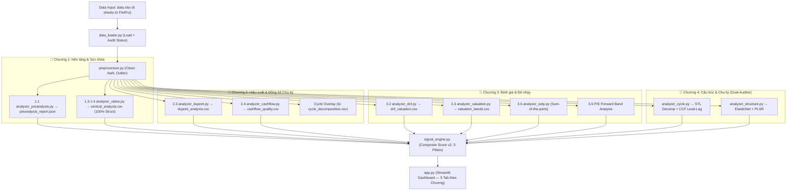

# Fiinpro Analysis — Khung Phân Tích Cơ Cấu & Chu Kỳ Tài Chính (v3.0)

Hệ thống tự động hóa phân tích BCTC định lượng chuyên sâu. Triết lý cốt lõi: **Hệ thống không dự báo — Hệ thống chẩn đoán.** Thay vì đưa ra con số dự báo điểm, hệ thống trả lời 3 câu hỏi:

1. 🏛️ **Hình thái tài chính** của doanh nghiệp trông như thế nào?
2. 🔄 **Doanh nghiệp đang ở đâu** trong chu kỳ tài chính của nó?
3. 💰 **Thị trường đang định giá** điều này đúng hay sai?

> 🌐 **GitHub Pages:** [https://wane-bs.github.io/fiinpro_tt/](https://wane-bs.github.io/fiinpro_tt/)

---

## 1. Pipeline Vận Hành (Data Flow)


```mermaid
flowchart TD
    A["Data Input: data.xlsx (6 sheets từ FiinPro)"] --> B["data_loader.py (Load + Audit Status)"]
    B --> C["preprocessor.py (Clean NaN, Outlier)"]

    subgraph "📘 Chương 1: Nền tảng & Sức khỏe"
        C --> D1["1.1 analyzer_preanalysis.py → preanalysis_report.json"]
        C --> D2["1.3-1.4 analyzer_ratios.py → vertical_analysis.csv (100% Struct)"]
    end

    subgraph "📗 Chương 2: Hiệu suất & Đồng bộ Chu kỳ"
        C --> E1["2.3 analyzer_dupont.py → dupont_analysis.csv"]
        C --> E2["2.4 analyzer_cashflow.py → cashflow_quality.csv"]
        C --> E3["Cycle Overlay (từ cycle_decomposition.csv)"]
    end

    subgraph "📙 Chương 3: Định giá & Độ nhạy"
        C --> F1["3.2 analyzer_dcf.py → dcf_valuation.csv"]
        C --> F2["3.3 analyzer_valuation.py → valuation_bands.csv"]
        C --> F3["3.5 analyzer_sotp.py (Sum-of-the-parts)"]
        C --> F4["3.6 P/E Forward Band Analysis"]
    end

    subgraph "📕 Chương 4: Cấu trúc & Chu kỳ (Dual-Auditor)"
        C --> G1["analyzer_cycle.py → STL Decomp + CCF Lead-Lag"]
        C --> G2["analyzer_structure.py → ElasticNet + PLSR"]
    end

    D1 & D2 & E1 & E2 & F1 & F2 & F3 & F4 & G1 & G2 --> H["signal_engine.py (Composite Score v2: 3 Pillars)"]
    H --> I["app.py (Streamlit Dashboard — 5 Tab theo Chương)"]
```

---

## 2. Cấu trúc Thư mục

```text
fiinpro_analysis/
├── README.md              ← Tài liệu này
├── techspec.md            ← Đặc tả kỹ thuật chi tiết
├── .gitignore             ← Quản lý file rác và dữ liệu nhạy cảm
├── requirements.txt
├── src/
│   ├── main.py                    ← Entry point (chạy toàn bộ pipeline)
│   ├── data_loader.py             ← Đọc data.xlsx, tách Audit Status
│   ├── segment_loader.py          ← [NEW] Tải dữ liệu phân đoạn (IR data)
│   ├── analyzer_ratios.py         ← [UPDATE] 100% Vertical Analysis logic
│   ├── analyzer_sotp.py           ← [NEW] Định giá từng phần (SoTP)
│   ├── app.py                     ← [UPDATE] Dashboard (No-cache + New Charts)
│   └── ... (các analyzer khác)
├── backtest/              ← [UPDATE] Toàn bộ module kiểm định được dời vào đây
└── output/                ← Kết quả phân tích (~40 files)
```

---

## 3. Hướng dẫn Chạy

**Cài đặt thư viện:**
```bash
pip install -r requirements.txt
```

**Chạy toàn bộ pipeline phân tích:**
```bash
python src/main.py
```
Tất cả kết quả sẽ xuất vào `output/`.

**Khởi chạy Dashboard Streamlit:**
```bash
streamlit run src/app.py
```

---

## 4. Danh mục Output Bổ sung (v3.0)

| File | Chương | Nội dung |
|:---|:---:|:---|
| `pe_forward_band.csv` | 3 | Dải P/E lịch sử kết hợp EPS dự phóng |
| `sotp_valuation.csv` | 3 | Định giá chi tiết theo từng mảng kinh doanh |
| `sotp_waterfall.csv` | 3 | Dữ liệu vẽ biểu đồ Waterfall SoTP |
| `composite_signal.csv` | Báo cáo | Điểm 3 Trụ cột: Sức khỏe (30%), Tăng trưởng (35%), Định giá (35%) |

---

## 5. Kiến trúc Machine Learning & Định giá
Hệ thống sử dụng mô hình kết hợp giữa:
- **Định lượng BCTC:** Phân tích cơ cấu 100% (Vertical Analysis).
- **Machine Learning:** Dual-Auditor (ElasticNet + PLSR) để tìm Structural Drivers.
- **Định giá đa lớp:** DCF + Multiples + SoTP + P/E Band.

> **Lưu ý:** `data.xlsx` là file dữ liệu nguồn từ FiinPro, không được commit lên GitHub.
